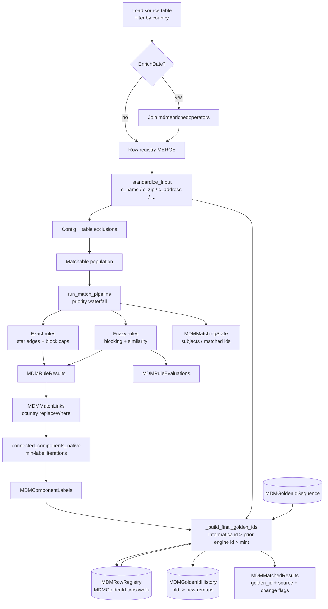

# MDM Match Architecture

## Overview

The match engine lives in `src/matching/` as a **batch, country-scoped** Spark job. It never uses Python UDFs or GraphFrames. Intermediate stewardship tables are materialised to Delta so each waterfall stage can restart from durable state and stewards can inspect rule evidence. (A future `src/merging/` package will cover survivorship / merge.)

## Pipeline flowchart

## Exact matching

For each exact rule (sorted by `priority`):

1. Optionally anti-join already-matched `record_id`s when `priorityMatching` and no subject set.
2. Apply rule `match_exclusion_filter`.
3. Keep rows with valid non-empty key columns.
4. Build a SHA-256 `match_key` over normalised (or raw) column values.
5. Drop blocks outside `[2, exact_max_block_size]`.
6. Emit **star edges** from `min(record_id)` anchor to every other member of the block.

## Fuzzy matching

For each fuzzy rule:

1. Resolve named blocks from `default_fuzzy_blocking` (or inline `blocking`).
2. Keep blocks sized within configured caps.
3. Pair records inside each block; attach standardised fields.
4. Compute Levenshtein / token-Jaccard evidence columns; evaluate rule `decision` (`all` / `any`).
5. Optionally materialise **all** candidates (matched and not) into `MDMRuleEvaluations` with similarity **percentages**.

## Connected components

`connected_components_native` seeds `golden_id = record_id`, then iteratively propagates the **minimum** neighbour label through a bidirectional edge list, writing each iteration to `MDMComponentLabels` until convergence or `max_iterations`.

`connected_components_native` raises if the graph has not converged within `components_max_iterations` (default 30); partial labels are never used.

## Golden IDs (Informatica continuity)

The company migrates from Informatica MDM **country by country**. Informatica golden ids
(`ufsoperator.GoldenRecordId`) must never change, engine-minted ids must be of the same
shape (BIGINT), globally unique, disjoint from Informatica's range, and stable across runs.
Implementation: `golden_ids.py`, state in `MDMRowRegistry` (crosswalk),
`MDMGoldenIdSequence` (allocator) and `MDMGoldenIdHistory` (XREF).

### Registry crosswalk (`_ensure_row_registry`)

- `SourceGoldenRecordId` is updated **only when the source value is non-null**. A known
  Informatica id is never downgraded to NULL (Informatica stops populating it after
  migration); a non-null → different non-null change is accepted (Informatica re-merged
  while it still owned the country).
- After each run, `MDMGoldenId` / `MDMGoldenIdSource` (`INFORMATICA` | `ENGINE`) /
  `MDMGoldenIdAssignedDate` store the engine's assignment per row. The assigned date only
  changes when the id changes.

### Selection per component (`_build_final_golden_ids`)

For each connected component (`TempClusterId` = min `record_id`, purely internal):

1. **Collect candidates** from its records:
   tier 1 = Informatica `SourceGoldenRecordId` (date = `GoldenIDCreatedDate`);
   tier 2 = previous engine assignment where `MDMGoldenIdSource = 'ENGINE'`
   (date = `MDMGoldenIdAssignedDate`).
2. **Claim**: an id present in several components (Informatica cluster split by the engine,
   or an engine cluster that split) goes to exactly one component — ranked by
   records already carrying it as their assigned id (incumbency) ↓, records carrying it ↓,
   earliest date ↑, smallest `TempClusterId` ↑.
3. **Choose**: each component takes its best claimed id — tier ↑ (Informatica beats
   engine), earliest date ↑, smallest id ↑. The other claimed ids are retired
   (**merge**; recorded in history).
4. **Mint**: components with no claimed id receive `base + row_number()` in
   `TempClusterId` order, where `base = max(golden_id_floor, sequence high-water mark,
   max(SourceGoldenRecordId)+1, max(MDMGoldenId)+1)` over the whole registry. The range is
   reserved by a conditional MERGE on `MDMGoldenIdSequence` and read back, so a concurrent
   run cannot hand out the same numbers. `SYNTHETIC_GOLDEN_ID_OFFSET` is deprecated.

All ranking is deterministic → identical input yields identical ids. Every id is the
golden id of at most one component per run.

### Splits and merges

- **Merge** of two clusters with ids A and B: one wins by the rules above (Informatica >
  engine, then earliest); history row `B → A, Reason='MERGE'`.
- **Split** of a cluster with id A: the sub-cluster with the most incumbent records keeps A;
  the other sub-cluster reuses its own prior engine id if it has one, else mints;
  history row `A → new, Reason='SPLIT'` with `RecordCount`.
- `Reason` is derived, not guessed: `SPLIT` when the old id still exists on another
  cluster in this run, otherwise `MERGE`.

### Safety checks (`validate_golden_id_space`, run before matching)

- `max(SourceGoldenRecordId) < golden_id_floor` — otherwise Informatica could later mint
  an id the engine already handed out. Raise `golden_id_floor` (same value in every
  country config) if this fires.
- No `ENGINE`-sourced `MDMGoldenId` equals any `SourceGoldenRecordId` in the registry.

### Output columns in `MDMMatchedResults`

`golden_id`, `golden_id_source`, `golden_id_is_new`, `previous_golden_id`,
`previous_golden_id_source`, `golden_id_changed` (vs previous engine assignment),
`golden_id_differs_from_source` (vs Informatica id — the key migration-validation flag),
plus `SourceGoldenRecordId`.

Excluded records are labelled `final_match_rule = "Excluded from Match"`; unmatched singles get `"Self/No Match"`. Both still receive a (stable) golden id.

Tip: to forbid the engine from ever splitting an Informatica cluster, add an exact rule on
`GoldenRecordId` (`exact_not_empty`) to the country config — Informatica groupings then
become match edges. This changes match semantics and is intentionally not enabled by default.

## Scala prototype note

An earlier Scala notebook explored union-once patterns, confidence scores, and dual-pass enriched-vs-original reporting. Those ideas may be ported into this Python package later; they are **not** the execution base.
