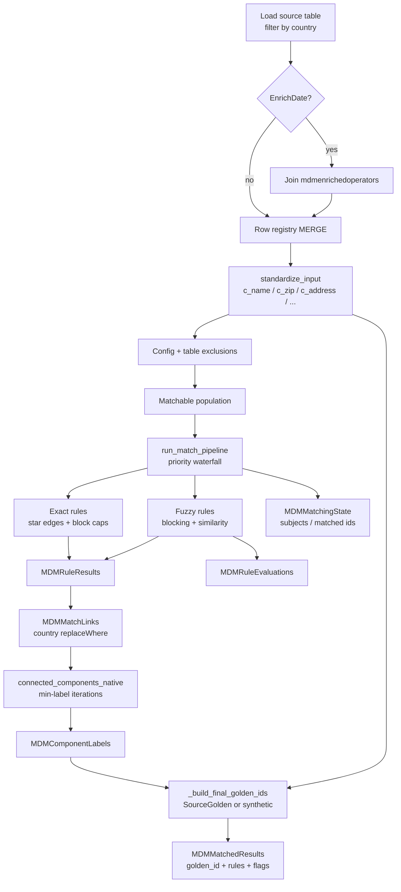

# MDM Match Architecture

## Overview

The engine is a **batch, country-scoped** Spark job. It never uses Python UDFs or GraphFrames. Intermediate stewardship tables are materialised to Delta so each waterfall stage can restart from durable state and stewards can inspect rule evidence.

## Pipeline flowchart

## Exact matching

For each exact rule (sorted by `priority`):

1. Optionally anti-join already-matched `record_id`s when `priorityMatching` and no subject set.
2. Apply rule `match_exclusion_filter`.
3. Keep rows with valid non-empty key columns.
4. Build a SHA-256 `match_key` over normalised (or raw) column values.
5. Drop blocks outside `[2, exact_max_block_size]`.
6. Emit **star edges** from `min(record_id)` anchor to every other member of the block.

## Fuzzy matching

For each fuzzy rule:

1. Resolve named blocks from `default_fuzzy_blocking` (or inline `blocking`).
2. Keep blocks sized within configured caps.
3. Pair records inside each block; attach standardised fields.
4. Compute Levenshtein / token-Jaccard evidence columns; evaluate rule `decision` (`all` / `any`).
5. Optionally materialise **all** candidates (matched and not) into `MDMRuleEvaluations` with similarity **percentages**.

## Connected components

`connected_components_native` seeds `golden_id = record_id`, then iteratively propagates the **minimum** neighbour label through a bidirectional edge list, writing each iteration to `MDMComponentLabels` until convergence or `max_iterations`.

## Golden IDs

Within each component (`TempClusterId`):

1. Prefer the oldest non-null `SourceGoldenRecordId` (`GoldenIDCreatedDate`, then ID).
2. Otherwise assign `SYNTHETIC_GOLDEN_ID_OFFSET (1e8) + TempClusterId`.

Excluded records are labelled `final_match_rule = "Excluded from Match"`; unmatched singles get `"Self/No Match"`.

## Scala prototype note

An earlier Scala notebook explored union-once patterns, confidence scores, and dual-pass enriched-vs-original reporting. Those ideas may be ported into this Python package later; they are **not** the execution base.
