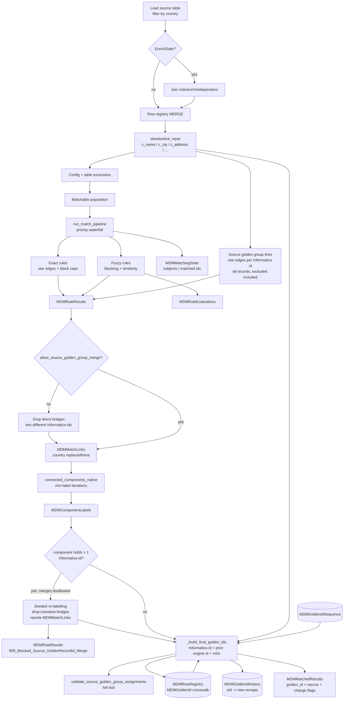

# MDM Match Architecture

## Overview

The match engine lives in `src/matching/` as a **batch, country-scoped** Spark job. It never uses Python UDFs or GraphFrames. Intermediate stewardship tables are materialised to Delta so each waterfall stage can restart from durable state and stewards can inspect rule evidence. (A future `src/merging/` package will cover survivorship / merge.)

## Pipeline flowchart

## Exact matching

For each exact rule (sorted by `priority`):

1. Optionally anti-join already-matched `record_id`s when `priorityMatching` and no subject set.
2. Apply rule `match_exclusion_filter`.
3. Keep rows with valid non-empty key columns.
4. Build a SHA-256 `match_key` over normalised (or raw) column values.
5. Drop blocks outside `[2, exact_max_block_size]`.
6. Emit **star edges** from `min(record_id)` anchor to every other member of the block.

## Fuzzy matching

For each fuzzy rule:

1. Resolve named blocks from `default_fuzzy_blocking` (or inline `blocking`).
2. Keep blocks sized within configured caps.
3. Pair records inside each block; attach standardised fields.
4. Compute Levenshtein / token-Jaccard evidence columns; evaluate rule `decision` (`all` / `any`).
5. Optionally materialise **all** candidates (matched and not) into `MDMRuleEvaluations` with similarity **percentages**.

## Connected components

`connected_components_native` seeds `golden_id = record_id`, then iteratively propagates the **minimum** neighbour label through a bidirectional edge list, writing each iteration to `MDMComponentLabels` until convergence or `max_iterations`.

`connected_components_native` raises if the graph has not converged within `components_max_iterations` (default 30); partial labels are never used.

## Golden IDs (Informatica continuity)

The company migrates from Informatica MDM **country by country**. Policy agreed with the
business: **existing Informatica groupings keep the same golden id; only records that are
not part of an existing grouping get a new golden id.** Concretely:

| Situation | Outcome |
|-----------|---------|
| Records Informatica grouped under id `X` | Always one component, golden id `X` — never split, never renamed |
| New record (no Informatica id) matching a member of group `X` | Inherits `X` |
| New records forming a cluster with no Informatica id | Engine id minted `>= golden_id_floor` (1e8), reused on later runs |
| Engine rules bridge groups `X` and `Y` | `allow_source_golden_group_merge=false`: bridging edges dropped and recorded, both keep their id. `true`: one id wins (earliest `GoldenIDCreatedDate`, then smallest), other logged `MERGE` |
| Record excluded from matching that carries id `X` | Stays in group `X` with golden id `X` (`final_match_rule = "Excluded from Match, Source_GoldenRecordId"`); it just gets no *new* matches |

Engine-minted ids are of the same shape (BIGINT), globally unique, disjoint from
Informatica's range, and stable across runs.
Implementation: `source_golden_groups.py` (hard links), `golden_ids.py` (selection),
state in `MDMRowRegistry` (crosswalk), `MDMGoldenIdSequence` (allocator) and
`MDMGoldenIdHistory` (XREF).

### Source golden groups as hard links (`source_golden_groups.py`)

With `preserve_source_golden_groups` (default `true`):

1. From the **full processed population** (excluded records included) every non-null
   `SourceGoldenRecordId` shared by ≥ 2 records yields star edges anchor = min `record_id` →
   member, `match_rule = Source_GoldenRecordId`, `rule_priority = 0`, `edge_type =
   source_golden`, `block_name = source_golden_group`, `match_key` = the Informatica id,
   both endpoints flagged as rule subjects. No block-size cap.
2. The edges are materialised to `MDMRuleResults` (stage `000_Source_GoldenRecordId`,
   `RuleType = source_golden`) and unioned with the waterfall edges into `MDMMatchLinks`,
   so they take part in connected components and appear in `final_match_rule`.
3. They are deliberately **outside the priority waterfall**: they do not mark records as
   matched for later rules, so they never change which rule other records match on. A group
   member can still match new records through any rule.

Cross-group merges (`allow_source_golden_group_merge`, MY default `false`):

- **Direct bridges** — an engine edge whose endpoints carry two different non-null
  Informatica ids — are filtered before components.
- **Transitive bridges** — a new record (or a chain of them) linking members of two groups —
  are only visible after components. Components holding more than one Informatica id are
  re-labelled with a seeded min-label propagation: records with an Informatica id keep their
  own id as label, others take the smallest label reachable through neighbours without an id
  (stages `source_group_labels_*` in `MDMComponentLabels`). Edges whose endpoints end up with
  different labels are dropped; each label is then exactly one connected component
  (stage `labels_source_groups_resolved`). `MDMMatchLinks` is rewritten without the dropped
  edges. Unlabelled records in such a component are impossible; a non-converged propagation
  raises like `connected_components_native`.
- Every dropped edge is written to `MDMRuleResults` stage
  `999_Blocked_Source_GoldenRecordId_Merge` (`RuleType = blocked`,
  `blocked_source_group_merge = true`, `src_source_golden_id` / `dst_source_golden_id` = the
  Informatica group each endpoint resolved to, original `match_rule` / `match_key` kept).
  Stewards can review them and, if two Informatica groups really are one operator, resolve
  it upstream or enable merges.

Trade-off: `false` guarantees that no Informatica id ever changes (safest for the
migration cut-over and downstream crosswalks) at the cost of leaving true duplicates that
Informatica had already separated as two golden records. `true` de-duplicates them but
retires one Informatica id per merge (traceable in `MDMGoldenIdHistory`).

### Registry crosswalk (`_ensure_row_registry`)

- `GoldenRecordId` arrives as a numeric **string**. Values are trimmed and cast to BIGINT;
  a non-blank value that is not an integer string (`^[0-9]+$`) **fails the run** so no id is
  silently turned into NULL (which would drop the record out of its Informatica group).
- `SourceGoldenRecordId` is updated **only when the source value is non-null**. A known
  Informatica id is never downgraded to NULL (Informatica stops populating it after
  migration); a non-null → different non-null change is accepted (Informatica re-merged
  while it still owned the country).
- After each run, `MDMGoldenId` / `MDMGoldenIdSource` (`INFORMATICA` | `ENGINE`) /
  `MDMGoldenIdAssignedDate` store the engine's assignment per row. The assigned date only
  changes when the id changes.

### Selection per component (`_build_final_golden_ids`)

For each connected component (`TempClusterId` = min `record_id`, purely internal):

1. **Collect candidates** from its records:
   tier 1 = Informatica `SourceGoldenRecordId` (date = `GoldenIDCreatedDate`);
   tier 2 = previous engine assignment where `MDMGoldenIdSource = 'ENGINE'`
   (date = `MDMGoldenIdAssignedDate`).
2. **Claim**: an id present in several components (Informatica cluster split by the engine,
   or an engine cluster that split) goes to exactly one component — ranked by
   records already carrying it as their assigned id (incumbency) ↓, records carrying it ↓,
   earliest date ↑, smallest `TempClusterId` ↑.
3. **Choose**: each component takes its best claimed id — tier ↑ (Informatica beats
   engine), earliest date ↑, smallest id ↑. The other claimed ids are retired
   (**merge**; recorded in history).
4. **Mint**: components with no claimed id receive `base + row_number()` in
   `TempClusterId` order, where `base = max(golden_id_floor, sequence high-water mark,
   max(SourceGoldenRecordId)+1, max(MDMGoldenId)+1)` over the whole registry. The range is
   reserved by a conditional MERGE on `MDMGoldenIdSequence` and read back, so a concurrent
   run cannot hand out the same numbers. `SYNTHETIC_GOLDEN_ID_OFFSET` is deprecated.

All ranking is deterministic → identical input yields identical ids. Every id is the
golden id of at most one component per run. With preserved source groups the claim step
never has to arbitrate an **Informatica** id (all its records are in one component by
construction); it only arbitrates prior **engine** ids whose clusters split.

### `golden_id_floor` (1e8)

`golden_id_floor` is `100000000`. Informatica's max `GoldenRecordId` was `9 999 993`
(Sep 2026, `SELECT max(GoldenRecordId) FROM sl_bdl_processed_cd_prod.cd.vw_ufsoperator`) and
keeps growing slowly for countries Informatica still serves; 1e8 leaves 10x headroom while
keeping engine ids 9 digits. To change it: set the **same** value in every
`conf/countries/*.json` (and the seed in `sql/setup_tables.sql`), and only ever **raise** it —
the allocator takes `max(floor, sequence high-water mark, …)`, so lowering has no effect on an
existing sequence and would only confuse readers.

### Splits and merges

- **Merge** of two clusters with ids A and B: one wins by the rules above (Informatica >
  engine, then earliest); history row `B → A, Reason='MERGE'`. Two Informatica ids can only
  merge when `allow_source_golden_group_merge` is true.
- **Split** of a cluster with id A: the sub-cluster with the most incumbent records keeps A;
  the other sub-cluster reuses its own prior engine id if it has one, else mints;
  history row `A → new, Reason='SPLIT'` with `RecordCount`. With preserved source groups this
  can only happen to engine ids — an Informatica id split is a validation failure.
- `Reason` is derived, not guessed: `SPLIT` when the old id still exists on another
  cluster in this run, otherwise `MERGE`.

### Safety checks

Before matching (`validate_golden_id_space`):

- `max(SourceGoldenRecordId) < golden_id_floor` — otherwise Informatica could later mint
  an id the engine already handed out. Raise `golden_id_floor` (same value in every
  country config) if this fires.
- No `ENGINE`-sourced `MDMGoldenId` equals any `SourceGoldenRecordId` in the registry.

After golden id selection, before any write-back (`validate_source_golden_group_assignments`,
only with `preserve_source_golden_groups`): for every Informatica id in the country, all its
records are in exactly one component, that component's id is Informatica-sourced (never
minted), and — unless merges are allowed — equals the Informatica id itself. A violation
raises `RuntimeError`; the only side effect of the failed run is a burnt range in
`MDMGoldenIdSequence` (a gap, like a database sequence).

### Output columns in `MDMMatchedResults`

`golden_id`, `golden_id_source`, `golden_id_is_new`, `previous_golden_id`,
`previous_golden_id_source`, `golden_id_changed` (vs previous engine assignment),
`golden_id_differs_from_source` (vs Informatica id — the key migration-validation flag),
plus `SourceGoldenRecordId`.

`final_match_rule` lists every rule that linked the record (sorted, comma separated), including
`Source_GoldenRecordId` for members of an Informatica group. Excluded records are labelled
`"Excluded from Match"` — or `"Excluded from Match, Source_GoldenRecordId"` when they stay in
their Informatica group (then `is_matched` reflects the group size) — and unmatched singles
get `"Self/No Match"`. All still receive a (stable) golden id.
With `preserve_source_golden_groups` and merges disallowed, `golden_id_differs_from_source`
is always `false`; a `true` value in that configuration cannot occur because the run fails first.

## Scala prototype note

An earlier Scala notebook explored union-once patterns, confidence scores, and dual-pass enriched-vs-original reporting. Those ideas may be ported into this Python package later; they are **not** the execution base.
